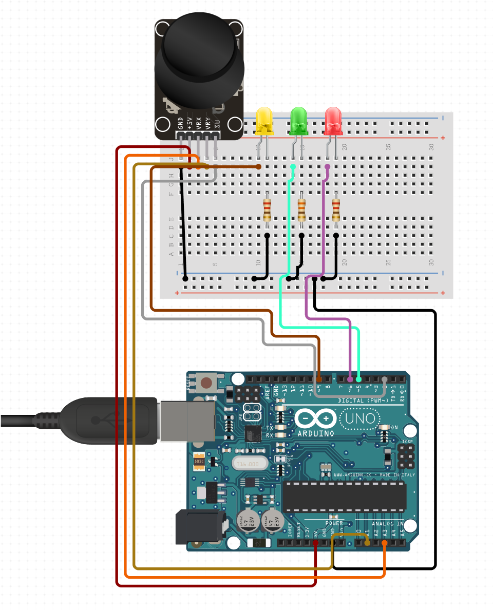
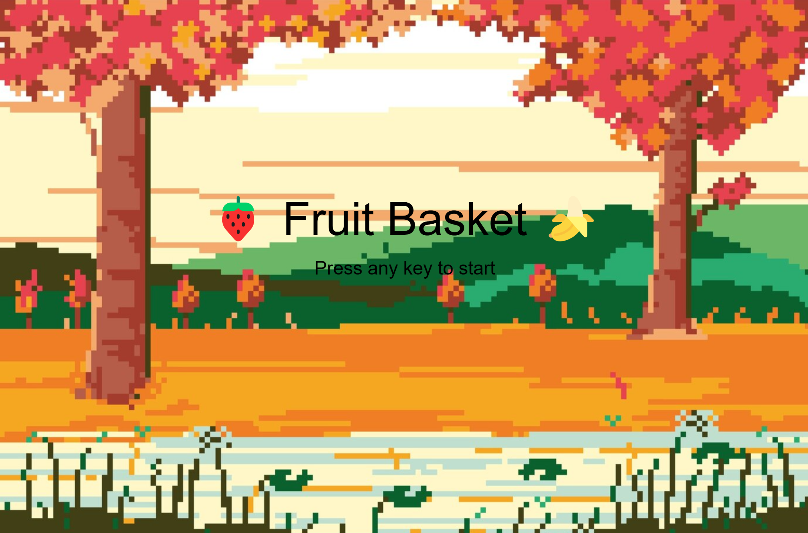
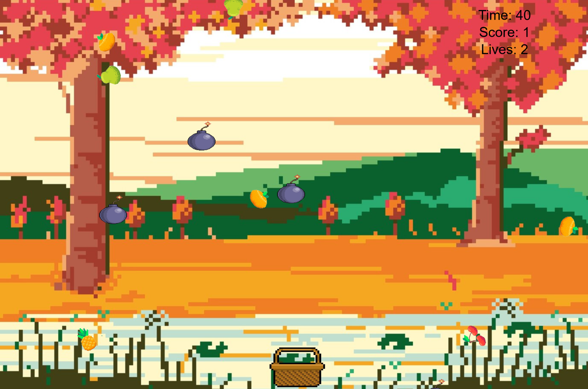
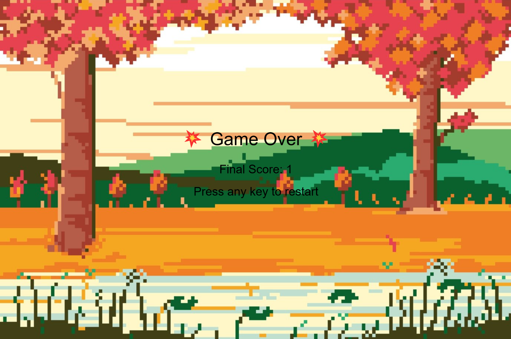

# Fruit Basket

Project Description:
-----------------------------------------------------------------------------------------
Basket Catcher is a web-based interactive game that combines physical computing with digital graphics and sound. In this game, players control a character wearing a basket, attempting to catch falling fruit while avoiding bombs. The game is built using p5.js for graphics, Tone.js for music and sound effects, and an Arduino joystick and LEDs for physical interactivity.

The player moves the character left and right using a joystick connected to an Arduino, which sends analog values to the game via serial communication. When fruit is caught, the score increases and a pleasant tone plays. If a bomb is caught, the player loses one of three lives — visually represented by three LEDs on the Arduino. A custom soundtrack composed with Tone.js plays in the background to enhance the gaming experience.

The game features multiple screens: a welcome screen, a gameplay scene with a timer and score, and a game-over screen when the timer runs out or lives are lost.

This project demonstrates how physical hardware can be used to influence real-time digital experiences using modern web technologies and microcontrollers.

Project Outline:
-----------------------------------------------------------------------------------------
1. Graphics Requirements (p5.js)
 3 scenes: Welcome, Gameplay, Game Over

 Timer variable to track game duration

 Score variable

 Life variable

 2 classes: Player (basket character) and Fruit/Bomb (falling objects)

 User interaction via joystick and keyboard

2. Physical Computing (Arduino)
 Analog input: Joystick (controls basket left/right)

 Digital output: 3 LEDs to display remaining lives

 Serial communication using p5.serialport

3. Sound (Tone.js)
 Custom looped background music using Tone.js Loop and Synths

 Sound effect for catching fruit

 Sound effect for catching bombs

 At least 3 instruments (synths), and 2 effects (delay, volume)

 One instrument parameter is modulated (e.g. envelope)

 Wiring Diagram:
 -----------------------------------------------------------------------------------------

Future Development:
-----------------------------------------------------------------------------------------

In the future, several features could be added to enhance gameplay and challenge:

Level Progression: Introduce multiple levels that gradually increase in difficulty as the player survives longer or scores higher. Each level could modify variables like fruit speed, spawn rate, or number of falling objects.

Difficulty Scaling: Implement a dynamic difficulty scaler that increases game speed or complexity based on the player's score, making the game more engaging and competitive over time.

More Falling Objects: Expand the variety of falling items beyond just fruit and bombs. For example:

-Power-ups that give bonus points or temporary shields.

-Rotten fruit that subtracts points.

-Special collectibles that unlock bonus levels or effects.

Images of the Project:
-----------------------------------------------------------------------------------------

Links:
-----------------------------------------------------------------------------------------
Video Example of Project:

https://youtu.be/Vh5QcbYxLaA

Files For the project:

https://github.com/mmor118/mmor118.github.io/tree/main/Final%20Project
